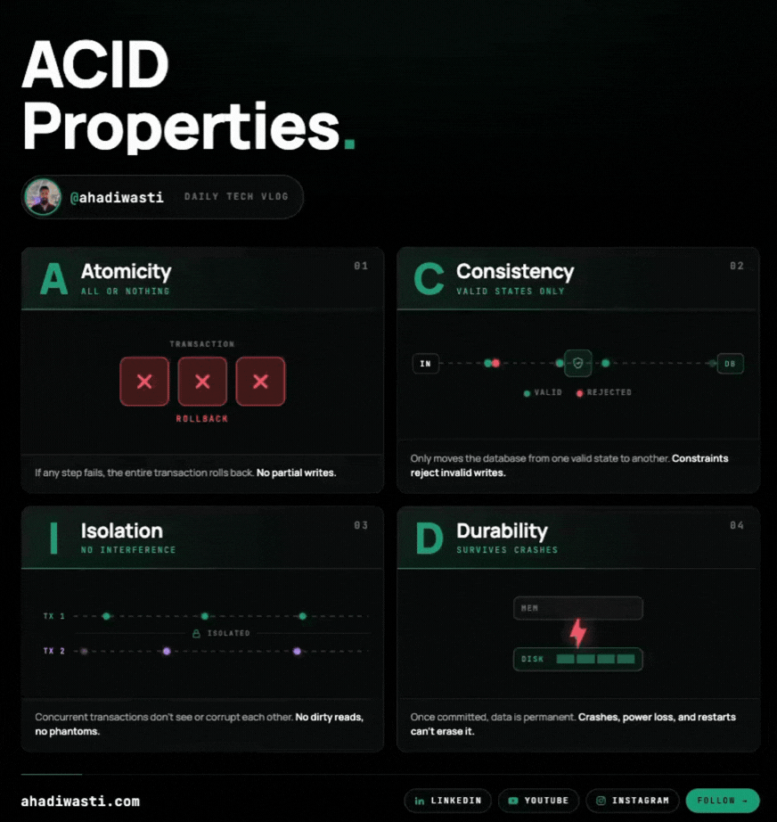

# ACID Transactions — What They Are and Why Every Backend Engineer Should Know Them

Your payment goes through. Your inventory doesn't update. Your customer is charged for something that's already out of stock.

That's what happens when your database doesn't enforce ACID. It's not a theoretical problem — it's a production incident waiting to happen.

ACID stands for **Atomicity, Consistency, Isolation, Durability**. Four properties that define whether your database can be trusted when things go wrong.



Let's break each one down.

---

## What Is a Database Transaction?

Before ACID, you need to understand what a *transaction* is.

A transaction is a group of operations your database treats as one single unit. It either all succeeds, or none of it does.

**Example: bank transfer**

1. Deduct $500 from Account A
2. Add $500 to Account B

If step 2 fails,  step 1 must be undone. Otherwise $500 just disappears. That rollback behaviour — that's a transaction doing its job.

---

## A — Atomicity

**All or nothing.**

A transaction either commits fully or rolls back completely. There is no in-between state. If any operation inside the transaction fails, the entire transaction is undone as if it never happened.

```sql
BEGIN;
  UPDATE accounts SET balance = balance - 500 WHERE id = 'A';
  UPDATE accounts SET balance = balance + 500 WHERE id = 'B';
COMMIT;
-- If anything fails above, ROLLBACK happens automatically
```

**How databases implement it:**
Databases write every operation to a Write-Ahead Log (WAL) *before* applying it to the actual data files. If a crash happens mid-transaction, the database reads the WAL on restart and either replays committed changes or rolls back incomplete ones.

---

## C — Consistency

**Valid state in, valid state out.**

A transaction can only bring the database from one valid state to another. It cannot violate schema constraints, foreign key rules, or business logic checks. If it tries to, the transaction is rejected.

**Example:** You can't place an order for 10 units when only 8 are in stock — if your schema enforces a non-negative stock constraint, the database will refuse the transaction outright.

```sql
-- This will fail if stock_quantity would go negative
UPDATE products SET stock_quantity = stock_quantity - 10 WHERE id = 42;
-- CHECK constraint: stock_quantity >= 0
```

Consistency is enforced through schema constraints (`NOT NULL`, `UNIQUE`, `CHECK`, `FOREIGN KEY`) and application-level validations.

---

## I — Isolation

**Concurrent transactions don't see each other's mess.**

Isolation ensures that while a transaction is in progress, its intermediate state is invisible to other transactions. Without it, two transactions reading and writing at the same time can corrupt each other's data.

**The three anomalies isolation protects you from:**

**Dirty Read** — Transaction A reads data that Transaction B hasn't committed yet. B rolls back. A is now holding data that never existed.

**Non-Repeatable Read** — Transaction A reads the same row twice. Between the two reads, Transaction B updated it. A gets different values for the same row in the same transaction.

**Phantom Read** — Transaction A queries a set of rows. Transaction B inserts a matching row. A re-runs the same query and gets different results.

**Isolation levels let you choose your trade-off:**

| Level | Dirty Read | Non-Repeatable Read | Phantom Read |
|---|---|---|---|
| Read Uncommitted | ✗ possible | ✗ possible | ✗ possible |
| Read Committed | ✓ prevented | ✗ possible | ✗ possible |
| Repeatable Read | ✓ prevented | ✓ prevented | ✗ possible |
| Serializable | ✓ prevented | ✓ prevented | ✓ prevented |

Higher isolation = stronger consistency, lower throughput. Most production systems run at **Read Committed** or **Repeatable Read** and handle the rest at the application layer.

Databases enforce isolation through **locking** (pessimistic — block conflicting reads/writes) or **MVCC** (optimistic — keep multiple row versions so readers don't block writers). PostgreSQL uses MVCC. MySQL InnoDB uses both.

---

## D — Durability

**Once committed, it stays committed.**

A committed transaction survives power failures, crashes, and restarts. The data is on disk. It's not going anywhere.

**How databases implement it:**

The same Write-Ahead Log used for atomicity is also what guarantees durability. The sequence is:

1. Write the operation to WAL on durable storage
2. Mark the transaction committed in the log
3. Apply changes to main data files (may happen asynchronously)

If the server crashes between steps 2 and 3, the WAL replays the committed changes on recovery. Nothing is lost.

Beyond WAL, production systems add:
- **Synchronous replication** — commit only confirmed when at least one replica acknowledges the write
- **Regular backups** — full + incremental, stored off-site

---

## The Rule of Thumb

| Property | The question it answers |
|---|---|
| Atomicity | Did everything happen, or nothing? |
| Consistency | Is the database still valid after this? |
| Isolation | Can concurrent transactions corrupt each other? |
| Durability | Will committed data survive a crash? |

If your database is PostgreSQL, MySQL, or any standard RDBMS — ACID is on by default. The trap most engineers fall into is assuming NoSQL databases give you the same guarantees. Many don't, or require you to explicitly opt in.

Know what your database actually promises before you trust it with critical data.

---

*Written by Abdul Hadi · ahadiwasti.com*
