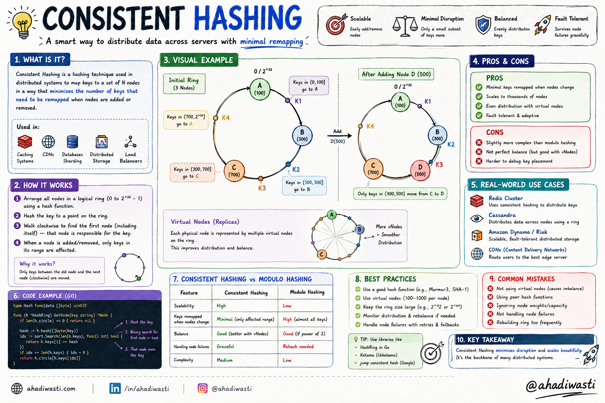
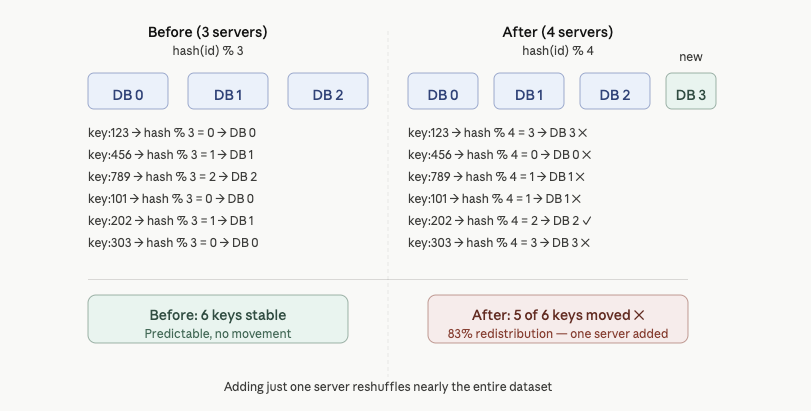
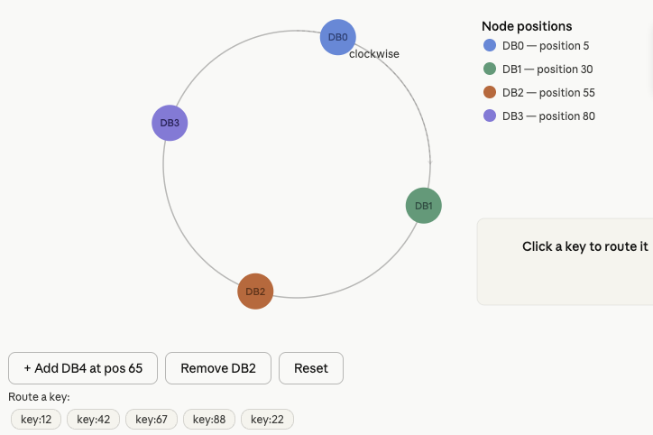
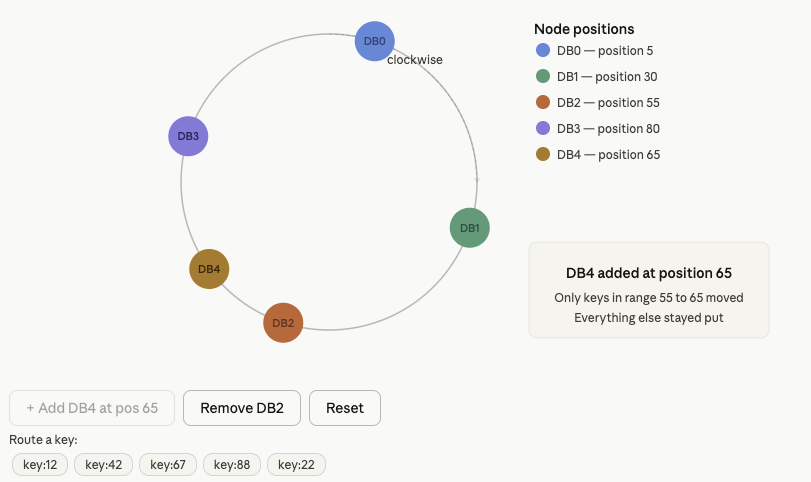
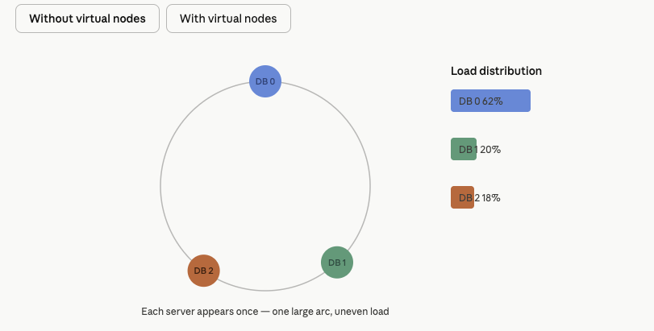
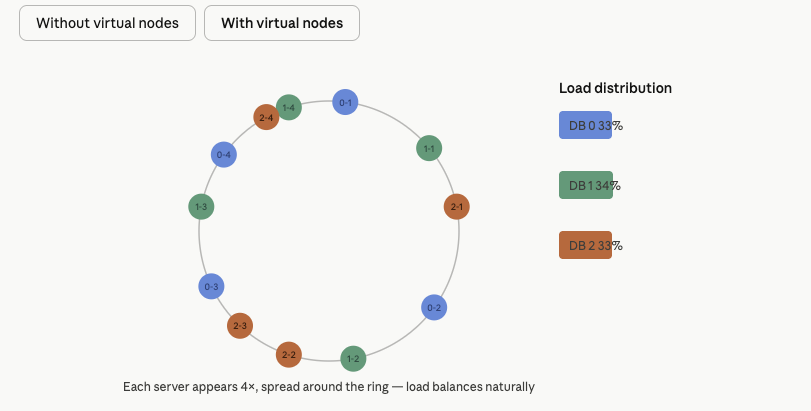

# Consistent Hashing: Scaling Distributed Systems Without Breaking Everything

When you are building distributed systems, one problem shows up again and again.

How do you distribute data across multiple servers without causing chaos every time a server is added or removed?

This is exactly what consistent hashing solves. By the end of this article you will understand why it was invented, how it works under the hood, and why it powers some of the largest systems in the world.

---



## A Simple System That Works, Until It Does Not

Imagine you are building an ordering platform. At the start, everything is simple. One application server, one database, clients sending requests. It works perfectly.

Then your traffic explodes.

As more users place orders, the database load climbs. Queries slow down. Writes get expensive. One database becomes a bottleneck, so you do the obvious thing: you scale horizontally by adding more databases. This process is called sharding.

But now a new problem appears.

**How does your server know which database should store a specific piece of data?**

---

## First Attempt: Modulo Hashing

The simplest approach is straightforward:

```
database_id = hash(request_id) % number_of_databases
```

For example, with three databases:

```
hash(req123) % 3 = 1  →  Database 1
hash(req456) % 3 = 2  →  Database 2
hash(req789) % 3 = 0  →  Database 0
```

Clean, simple, deterministic. This is called modulo hashing, and at first glance it looks like a solid solution.

---

## Why Modulo Hashing Falls Apart

The disaster begins the moment you scale.

### Adding a new database

Say you had three databases and your formula was `hash(id) % 3`. You add a fourth. Now your formula is `hash(id) % 4`.

Suddenly, almost every key maps to a different database:

```
Before:  hash(123) % 3 = 1
After:   hash(123) % 4 = 3
```

Instead of only migrating data to the new server, you end up redistributing nearly your entire dataset. Cache invalidations cascade. Databases get hammered. The system you carefully built starts buckling under the weight of its own reorganization.

### When a database goes down

The same problem happens on failure. One node drops out, your formula changes from `% 3` to `% 2`, and every single mapping shifts again. Another massive redistribution event, triggered by one server going offline.

Modulo hashing does not scale gracefully. You need something better.

<!-- INFOGRAPHIC 1: Modulo Hashing Failure
     Show the before/after key mapping table.
     Before (3 servers): 6 keys all land correctly.
     After (4 servers): 5 out of 6 keys remap to a different server, highlighted in red.
     Summary bar at the bottom: "83% redistribution from adding just one server."
-->



---

## Consistent Hashing: The Elegant Fix

Consistent hashing was designed to minimize data movement when the cluster changes. The core idea is surprisingly simple.

Instead of treating servers as positions on a line, you place them on a circle.

This circle is called a **hash ring**.

---

## How the Hash Ring Works

Here is the concept in three steps:

1. Create a circular hash space, typically ranging from 0 to 2^32.
2. Place your database nodes at positions on the ring by hashing their identifiers.
3. When a request comes in, hash its key onto the same ring and move clockwise until you hit the first node. That node owns the data.

Say your databases are positioned like this:

```
DB0 → position 5
DB1 → position 30
DB2 → position 55
DB3 → position 80
```

A request with a hash value of 42 lands between DB1 and DB2. Moving clockwise, it hits DB2 first. DB2 stores it.

Simple. Predictable. And critically, resilient to change.

<!-- INFOGRAPHIC 2: Interactive Hash Ring
     A circular ring with DB0, DB1, DB2, DB3 placed at their positions.
     Key pills below the ring: key:12, key:42, key:67, key:88, key:22.
     Clicking a key draws a dashed arrow from the key's position clockwise to its target node.
     Info panel bottom-right shows: key name, key position, and which node it routes to.
     Buttons: "+ Add DB4 at pos 65" shows only keys in range 55-65 moving.
               "Remove DB2" shows only its keys migrating clockwise to DB3.
               "Reset" restores the original four-node state.
-->




---

## Why This Changes Everything

The real magic of consistent hashing shows up when the cluster changes.

### Adding a database

You add DB4 at position 65, between DB2 (position 55) and DB3 (position 80).

Only the data that was sitting in the 55 to 65 range needs to move, from DB3 to DB4. Everything outside that range stays exactly where it was.

With modulo hashing, adding one server reshuffled almost everything. With consistent hashing, only a small, predictable slice of data moves.

### Removing a database

DB2 goes offline. Only the data that was assigned to DB2 migrates, moving clockwise to DB3. Every other node is untouched.

Minimal redistribution. Faster recovery. Much less chaos.

---

## One Problem Remains: Uneven Load

Consistent hashing solves redistribution, but it introduces a new challenge.

When nodes are placed at fixed positions on the ring, the arcs between them can vary wildly in size. One node might own a huge chunk of the ring. Another might own almost nothing. And if a heavily loaded node goes down, its neighbor inherits all of that traffic at once.

You end up with hot nodes and idle nodes sitting right next to each other.

---

## Virtual Nodes: Fixing the Balance

This is where virtual nodes, often called vnodes, come in.

Instead of placing each database once on the ring, you place it multiple times:

```
DB1-VN1, DB1-VN2, DB1-VN3, DB1-VN4
```

Each virtual node gets its own hash and its own position on the ring, spread across the entire space. Now when DB2 fails, its load does not slam into a single neighbor. It gets spread across many nodes in small chunks, because DB2's virtual nodes were distributed all around the ring.

The more virtual nodes you assign per server, the smoother the distribution becomes. This is the standard approach in production systems.

<!-- INFOGRAPHIC 3: Virtual Nodes Comparison
     Two-tab toggle: "Without virtual nodes" and "With virtual nodes."
     Without: Ring shows DB0, DB1, DB2 each appearing once, large uneven arcs.
              Load bars on the right: DB0 = 62%, DB1 = 20%, DB2 = 18%.
     With: Same three servers each appearing 4 times, evenly spread around the ring.
           Load bars: DB0 = 33%, DB1 = 34%, DB2 = 33%.
     Caption below: "More virtual nodes per server means smoother, more even distribution."
-->




---

## Replication Is a Separate Concern

A common point of confusion is mixing up consistent hashing with replication. They solve different problems.

Consistent hashing decides **where data lives**. Replication ensures that **data is not lost** when a node fails.

In Amazon DynamoDB, partitions are replicated across multiple availability zones. When a node fails, replicas are already in place. One gets promoted. No massive redistribution happens because consistent hashing kept the scope of impact small, and replication kept the data safe.

Apache Cassandra takes a similar approach, replicating data across multiple nodes on the ring so that no single failure causes data loss.

---

## The Hotspot Problem

Even with virtual nodes and replication, consistent hashing cannot fully protect you from hotspots.

A hotspot happens when certain keys become wildly more popular than others. Imagine a flash sale on a viral product. That one product key suddenly generates one hundred times more reads than anything else. Consistent hashing distributes data across nodes. It does not distribute popularity.

There are a few common strategies for handling this.

**Read replicas.** Duplicate popular data across multiple nodes and let a load balancer spread the read traffic. The hot key is no longer hitting a single machine.

**Key salting.** Instead of storing everything under `apple`, you split it across `apple-0`, `apple-1`, `apple-2`. Requests get fanned out across multiple nodes and then aggregated. This works well for predictable hotspots.

**Adaptive rebalancing.** Some systems detect hot partitions and move them dynamically to less loaded nodes. It is operationally complex but powerful when done well.

---

## Where You Will Find This in the Wild

Consistent hashing is not a theoretical concept. It is running in production at enormous scale across systems you use every day.

Apache Cassandra uses it to distribute data across its cluster, with virtual nodes enabled by default. Amazon DynamoDB uses a variant internally to route partition keys. Content delivery networks use it to route requests to cache nodes so that adding or removing a cache server does not invalidate every cached object globally. Distributed caches like Memcached clusters are often organized around consistent hashing for the same reason.

---

## Not Every System Uses It

It is worth noting that consistent hashing is not the only valid approach.

Redis Cluster, for example, takes a different direction. It divides the keyspace into 16,384 fixed hash slots and assigns slot ranges to nodes. This is easier to reason about and simpler to operate, but requires more coordination during rebalancing.

Both approaches make sense depending on the constraints of the system. Consistent hashing shines when nodes are added and removed frequently and you need minimal disruption. Fixed slot systems shine when you want predictable, manual control over data placement.

---

## The Idea in One Sentence

Consistent hashing solves one of the most painful problems in distributed systems: scaling without triggering a catastrophic redistribution of your entire dataset.

The insight that makes it work is placing both nodes and keys on the same circular space, so that a change to the cluster only disturbs the data that lives nearest to the change.

That one idea, hash ring plus clockwise routing, powers databases, caches, and content networks that serve billions of requests every day. Once you understand it, you start seeing the fingerprints of consistent hashing all over distributed infrastructure.
